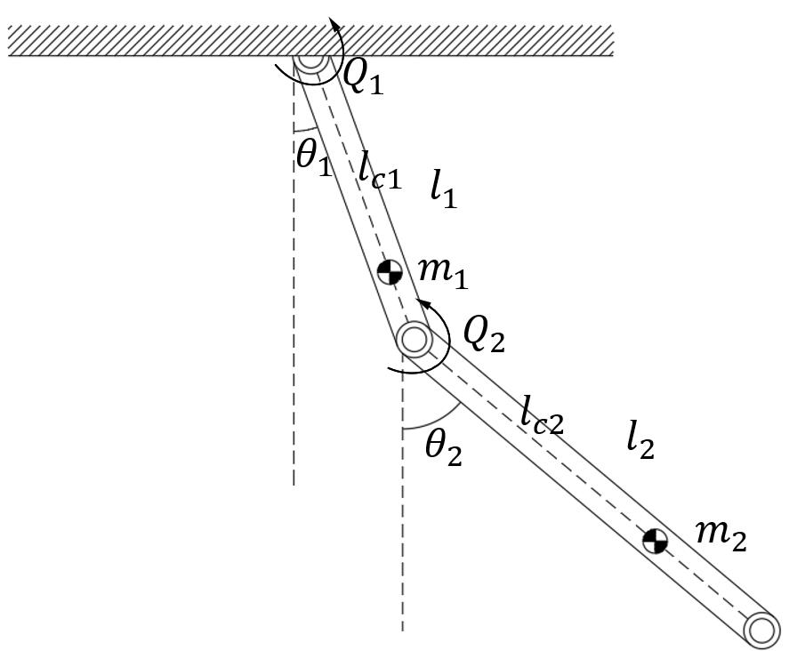

<!--
 * @Author: CTC 2801320287@qq.com
 * @Date: 2023-09-06 15:54:42
 * @LastEditors: CTC 2801320287@qq.com
 * @LastEditTime: 2023-09-06 20:54:00
 * @Description: Double pendulum dynamics derived with PoE
 * 
 * Copyright (c) 2023 by ${git_name_email}, All Rights Reserved. 
-->
# Double Pendulum Example

We attempt to model a double pendulum system under control with PoE. The system is shown as follows.

The inertia of two pendulums are $J_{1}$ and $J_{2}$ respectively. We set the x-axis vertically downwards and the y-axis horizontally to the right, and determined the z-axis using the right-hand rule.

Applying Jacobian matrixes and the second Lagrange theorem, it's easy to obtain dynamics of any robotic systems as follows:

$$
M(\vec{q}) \ddot{\vec{q}} + B(\vec{q}) \vec{\dot{q}\dot{q}} + C(\vec{q}, \dot{\vec{q}}) \vec{\dot{q}^{2}} + G(\vec{q}) = \tau_{d}.
$$

Where $B(\vec{q}) \vec{\dot{q}\dot{q}}$ represents Coriolis force, $C(\vec{q}, \dot{\vec{q}}) \vec{\dot{q}^{2}}$ represents centrifugal force, $G(\vec{q})$ represents gravity.

In this double-pendulum case, the special column vectors $\vec{\dot{q}\dot{q}}$ and $\vec{\dot{q}^{2}}$ follows:

$$
\vec{\dot{q}\dot{q}} = \begin{pmatrix}
    \theta_{1} \theta_{2}
\end{pmatrix}, \qquad
\vec{\dot{q}^{2}} = \begin{pmatrix}
    \theta_{1}^{2} \\
    \theta_{2}^{2}
\end{pmatrix}.
$$

We define $J_{i}$ to be the Jacobian matrix for the $i$-th rigid body, which is a function of $\vec{q}$. Jacobian matrixes can be obtained with PoE, as their columns are unit twists of their corresponding rigid bodies. $J_{1}$ and $J_{2}$ in this case are be derived as is shown below:
